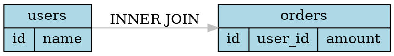

# SQL Table Relationship Graph

This module provides functionality to parse SQL SELECT statements and extract table relationships into a graph structure. The graph can be exported to various formats (DOT, JSON) for visualization and analysis.

## Features

- Parse SQL SELECT statements and extract table relationships
- Support for various JOIN types (INNER, LEFT, RIGHT, FULL, CROSS)
- Extract column information from JOIN conditions
- Export to Graphviz DOT format for visualization
- Export to JSON format for programmatic consumption
- Extensible formatter architecture

## Quick Start

### Basic Usage

```java
import com.sdchat.ogsql.ast.SelectQuery;
import com.sdchat.ogsql.graph.*;
import com.sdchat.ogsql.graph.formatter.*;

// Create a SELECT query
SelectQuery query = new SelectQuery();
query.addDataSource(new DataSource("users"));

DataSource orders = new DataSource("orders");
orders.setAlias("o");
orders.setJoinType("INNER");
orders.setJoinCondition("users.id = o.user_id");
query.addDataSource(orders);

// Extract graph
TableRelationshipExtractor extractor = new TableRelationshipExtractor();
TableRelationshipGraph graph = extractor.visitSelectQuery(query);

// Export to DOT format
DotFormatter dotFormatter = new DotFormatter();
String dot = dotFormatter.format(graph);
System.out.println(dot);

// Export to JSON format
JsonFormatter jsonFormatter = new JsonFormatter();
String json = jsonFormatter.format(graph);
System.out.println(json);
```

### Using Formatter Factory

```java
// Get formatter by format type
GraphFormatter<String> formatter = FormatterFactory.getFormatter("dot");
String output = formatter.format(graph);

// Or use the convenience method
String dotOutput = FormatterFactory.format(graph, "dot");
String jsonOutput = FormatterFactory.format(graph, "json");
```

## Data Model

### TableNode
Represents a table in the graph:
- `name`: Table name
- `alias`: Optional table alias
- `columns`: List of columns referenced from this table

### RelationshipEdge
Represents a relationship between two tables:
- `source`: Source table node
- `target`: Target table node
- `joinType`: Type of JOIN (INNER, LEFT, RIGHT, FULL, CROSS)
- `conditions`: List of join conditions (column pairs)

### TableRelationshipGraph
Container for the graph structure:
- Uses JGraphT as the underlying implementation
- Supports multiple edges between nodes
- Provides lookup by table name or alias

## Supported SQL Patterns

### Simple SELECT
```sql
SELECT id, name FROM users
```

### Single JOIN
```sql
SELECT u.*, o.* 
FROM users u 
INNER JOIN orders o ON u.id = o.user_id
```

### Multiple JOINs
```sql
SELECT u.*, o.*, p.*
FROM users u
INNER JOIN orders o ON u.id = o.user_id
LEFT JOIN products p ON o.product_id = p.id
```

### Complex JOIN Conditions
```sql
SELECT * FROM users u
INNER JOIN orders o ON u.id = o.user_id AND u.status = o.status
```

## Output Formats

### DOT Format
Graphviz DOT format for creating visual diagrams:



### JSON Format
Structured JSON for programmatic processing:

```json
{
  "nodes": [
    {
      "name": "users",
      "alias": "u",
      "columns": ["id", "name"]
    },
    {
      "name": "orders",
      "alias": "o",
      "columns": ["id", "user_id", "amount"]
    }
  ],
  "edges": [
    {
      "source": "u",
      "target": "o",
      "type": "INNER_JOIN",
      "joinConditions": [
        {
          "leftColumn": "users.id",
          "rightColumn": "orders.user_id"
        }
      ]
    }
  ]
}
```

## Extending

### Custom Formatter

Implement the `GraphFormatter<T>` interface:

```java
public class XmlFormatter implements GraphFormatter<String> {
    @Override
    public String format(TableRelationshipGraph graph) {
        // Your implementation
    }
    
    @Override
    public String getFormatType() {
        return "application/xml";
    }
    
    @Override
    public String getFileExtension() {
        return "xml";
    }
}

// Register the formatter
FormatterFactory.registerFormatter(new XmlFormatter());
```

## Testing

Run the integration tests:

```bash
mvn test -Dtest=TableRelationshipGraphTest
```

Run all graph-related tests:

```bash
mvn test -Dtest=*GraphFormatterTest,TableRelationshipGraphTest
```

## Dependencies

- JGraphT 1.5.2: Graph data structures and algorithms
- ANTLR4 Runtime: SQL parsing

## Limitations

- Currently supports SELECT statements only
- Subqueries are flattened (not preserved as nested structures)
- DML/DDL statements (INSERT, UPDATE, DELETE, CREATE) are not supported
